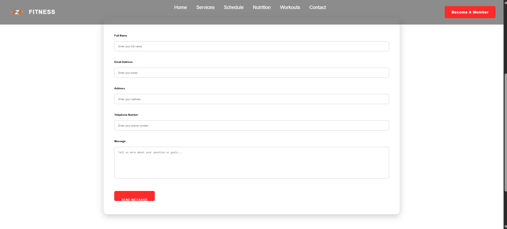

# CPTR331 Assignment 5 – ZEN Fitness

## CDN Provider
- Bootstrap/Skeleton CDN
- Fonts: Google Fonts
- Images, CSS, JS served from hosting provider with caching enabled

## Frameworks / Libraries
- Skeleton CSS
- Vanilla JavaScript
- Google Fonts

## JavaScript Features
- Contact form validation
- Sign-up form with localStorage
- Workout log system
- Goals tracker

## Performance
- Optimized images
- CSS/JS minified
- Tested with Lighthouse

## SEO & Accessibility
- Added alt attributes
- Semantic HTML structure
- robots.txt + sitemap.xml included

### 5.2 Hosting / CDN,
The site is hosted on GitHub Pages, which serves static files via a global CDN.
This improves:

Time to first byte (TTFB)

Static asset delivery (HTML, CSS, JS, images)

Overall reliability and performance

### 5.3 Lighthouse Results,
A Lighthouse report was generated in Chrome DevTools (Desktop) for the home page.

Performance: 100

Accessibility: 92

Best Practices: 78

SEO: 91

Key metrics:

First Contentful Paint (FCP): 0.6 s

Largest Contentful Paint (LCP): 0.6 s

Total Blocking Time (TBT): 0 ms

Speed Index: 0.6 s

A screenshot of the Lighthouse report is included in the project documentation.

## 6. Screenshots

### 6.1 Home Page (Index)

### 6.2 Contact Form

### 6.3 Lazy Loading Example

### 6.4 Lighthouse Performance Report (Desktop)

